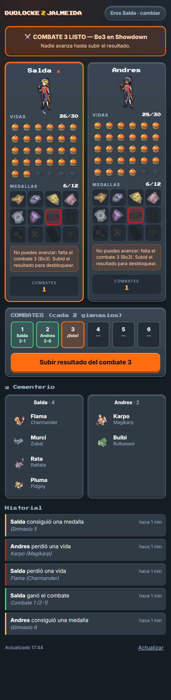
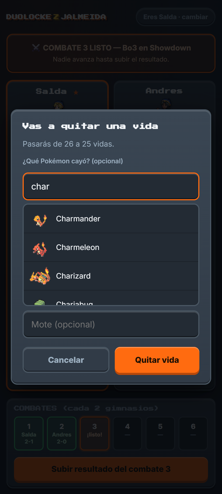
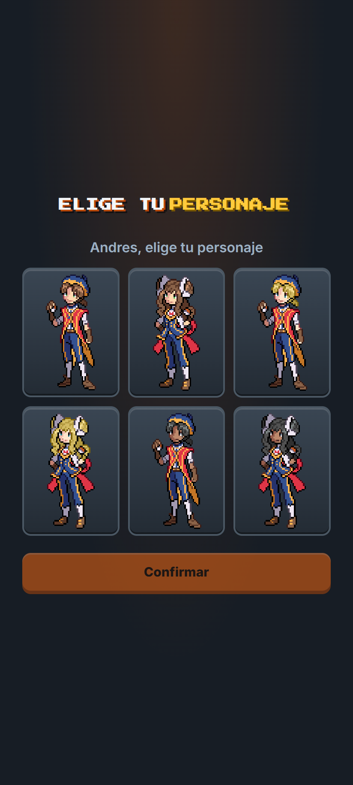

# 🔴 Duolocke Z Jalmeida

> Marcador web compartido, mobile-first y en vivo para llevar un **Duolocke** (nuzlocke a dos jugadores) de *Pokémon Z*: vidas, medallas, combates de checkpoint y caja de muertos, sincronizado entre los dos móviles.


**▶ En vivo:** https://duolocke-z-jalmeida.onrender.com  ·  *(free tier: la primera carga tras un rato inactivo puede tardar ~30 s en despertar)*

<p align="center">
  
</p>
<p align="center">
  
  &nbsp;
  
</p>

---

## Qué es y qué problema resuelve

Un **duolocke** es un nuzlocke jugado por dos personas en paralelo, con reglas caseras: muertes compartidas como "vidas", combates entre ambos cada cierto número de gimnasios, etc. Llevar todo eso en un papel o un Excel es incómodo y se desincroniza.

Esta app es un **marcador consultable desde el móvil** pensado para exactamente dos jugadores: cada uno abre el link, se identifica con su PIN y actualiza **solo su propio estado**; el otro lo ve al refrescar. No es un overlay de stream, es una herramienta de calidad de vida para la partida.

Es un proyecto **real, desplegado y en uso**, no un ejercicio: los assets, la paleta y las reglas salen de una partida concreta de un fangame de RPG Maker.

## Características

- **Estado compartido en vivo** — polling a `/api/state` cada 20 s y refresco inmediato al volver a la pestaña.
- **Vidas y medallas** con confirmación, corrección de errores e historial con nota.
- **Combates de checkpoint** — cada 2 gimnasios se bloquea el avance hasta que ambos jugadores suben el resultado del Bo3; motor de reglas propio que calcula bloqueos, checkpoints listos y fin del reto (0 vidas, o 12 medallas + desempate por puntos).
- **Caja de muertos ("cementerio")** — al perder una vida, buscador con los **1018 Pokémon** del juego (sprite + nombre) para registrar quién cayó y su mote.
- **Avatares del juego** — cada jugador elige su personaje entre los 6 protagonistas seleccionables de *Pokémon Z*.
- **Avisos del rival** — al abrir/refrescar te resume qué hizo el otro desde tu última visita.
- **Efectos de sonido** extraídos del propio juego (faint al morir, jingle al conseguir medalla).
- **PWA instalable** — se añade a la pantalla de inicio con icono propio y se abre a pantalla completa (`manifest.json` + service worker con estrategia red-primero para el código y caché para los assets).
- **Auth mínima por PIN** con rate-limit por IP (8 intentos fallidos → 15 min de bloqueo).
- **Assets 100 % del juego, cero IA** — sprites, iconos, audio y paleta extraídos de los archivos del fangame.

## Stack técnico

| Capa | Tecnología | Por qué |
|---|---|---|
| Backend / API | **Node.js + Express** | Un único servicio; sirve también el frontend estático. |
| Base de datos | **Turso** (libSQL / SQLite) | SQLite gestionado, free tier, cero infra. |
| Frontend | **HTML/CSS/JS vanilla**, mobile-first, PWA | Son 2 usuarios y 3 datos: un framework sería sobreingeniería. Decisión deliberada. |
| Hosting | **Render** (free) + **UptimeRobot** | Un solo Web Service; keep-alive contra el `/health` para evitar el cold start. |

Sin build step, sin dependencias de frontend, sin ORM. La lógica del reto vive aislada en un módulo puro (`src/rules.js`) que se testea fácil y se reutiliza en cliente y servidor.

## Cómo funciona

```
Móvil (PWA)  ──polling /api/state cada 20s──►  Express  ──►  Turso (SQLite)
     │                                            │
     └──POST con cabeceras x-duo-player/pin──►  auth + rules.js  ──► eventos, deaths, checkpoints
```

- Un **único servicio Express** sirve el frontend estático (`/public`) y una **API JSON**.
- El **estado completo** (jugadores, medallas, combates, historial y cementerio) se arma en `/api/state`; el cliente lo pinta y repinta por polling.
- Toda mutación exige `x-duo-player` + `x-duo-pin`; un jugador solo puede tocar su propia tarjeta.
- El **motor de reglas** (`src/rules.js`, sin dependencias) decide el bloqueo por combate cada 2 gimnasios y el final del reto; el mismo criterio se refleja en la UI.

## Assets extraídos del juego

Todo lo visual y sonoro sale de `Pokemon Z V2.18/` (esa carpeta **no** se sube al repo, está en `.gitignore`). Un par de scripts con Node y `System.Drawing` recortan y adaptan los sprites:

| Asset en la app | Origen en el juego |
|---|---|
| `sprites/ball.png` | `Graphics/Icons/item267.png` (Poké Ball) |
| `sprites/badges/badge01..12.png` | `Graphics/Transitions/getBadge0..11.png` (las 12 medallas reales) |
| `sprites/avatars/avatar1..6.png` | `Graphics/Characters/trainer000..005.png` (los 6 protagonistas) |
| `sprites/pokemon/pkmn{n}.png` | `Graphics/Icons/icon{NNN}.png`, recortado al 1er frame (1018 iconos) |
| `data/pokemon.json` | `PBS/pokemon.txt` (nombre + nº de cada especie, para el buscador) |
| `audio/life-lost.mp3` | `Audio/SE/faint.mp3` |
| `audio/badge.ogg` | `Audio/ME/Medalla.ogg` |

La **paleta** también es del juego: los paneles azul pizarra `#313B47` y el acento naranja `#FF6B10` son los del menú de pausa (DP Pause Menu) y sus windowskins. Medallas apagadas y vidas gastadas son la misma imagen con `filter: grayscale(1)`. El logo es tipografía *Press Start 2P* (no hizo falta generar nada con IA).

## Estructura del proyecto

```
server.js              Express + API + auth por PIN
src/db.js              cliente Turso + esquema SQL + migraciones
src/rules.js           motor de reglas del reto (puro, sin dependencias)
scripts/init-db.mjs    crea tablas y siembra el reto (--reset para empezar de cero)
public/                frontend: index.html, styles.css, app.js, manifest.json, sw.js
public/assets/         sprites, audio, iconos y pokemon.json (extraídos del juego)
render.yaml            infra como código para Render
```

## Ejecutar en local

```bash
npm install
npm run init-db      # crea tablas y siembra jugadores
npm start            # http://localhost:3000
```

Las variables van en `.env` (no se sube al repo):

```
TURSO_DATABASE_URL=libsql://<tu-db>.turso.io
TURSO_AUTH_TOKEN=<token de Turso>
PIN_SALDA=<pin del jugador 1>
PIN_ANDRES=<pin del jugador 2>
STARTING_LIVES=30
```

Para reiniciar el reto borrando todo: `npm run init-db -- --reset`.

## API

| Método | Ruta | Qué hace |
|---|---|---|
| `GET` | `/health` | 200 `ok` (keep-alive de UptimeRobot) |
| `GET` | `/api/state` | estado completo: jugadores, combates, historial, cementerio |
| `POST` | `/api/auth` | comprueba identidad + PIN |
| `POST` | `/api/avatar` | `{ avatar: "avatar1".."avatar6" }` |
| `POST` | `/api/lives` | `{ delta: -1｜1, dex?, species?, nickname?, note? }` |
| `POST` | `/api/badges` | `{ delta: -1｜1 }` |
| `POST` | `/api/checkpoint` | `{ number, winner, score? }` |
| `DELETE` | `/api/checkpoint/:n` | borra el resultado del último combate |

Todo lo que muta exige las cabeceras `x-duo-player` y `x-duo-pin`.

## Despliegue

Infra como código en [`render.yaml`](render.yaml). En resumen:

1. Render → **New Web Service** conectado al repo → Build `npm install`, Start `node server.js`, Health check `/health`.
2. Variables de entorno (las mismas del `.env`): URL y token de Turso, los dos PINs, `NODE_ENV=production`, `STARTING_LIVES`.
3. **UptimeRobot** → monitor HTTP a `https://<servicio>.onrender.com/health` cada 5 min para evitar el cold start del free tier.

---

<sub>Proyecto personal. *Pokémon* es marca de Nintendo/Game Freak; los sprites pertenecen a sus autores y se usan aquí solo para una herramienta privada de una partida entre dos amigos.</sub>
